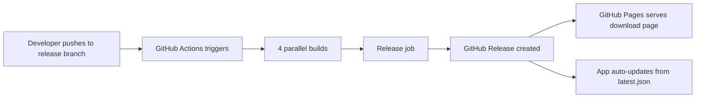
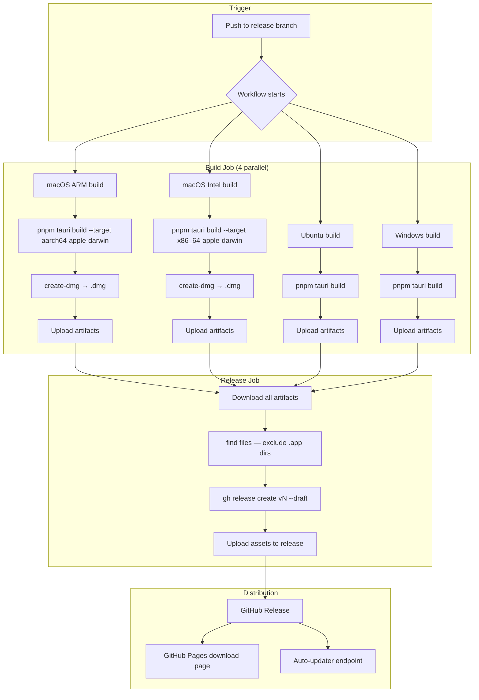
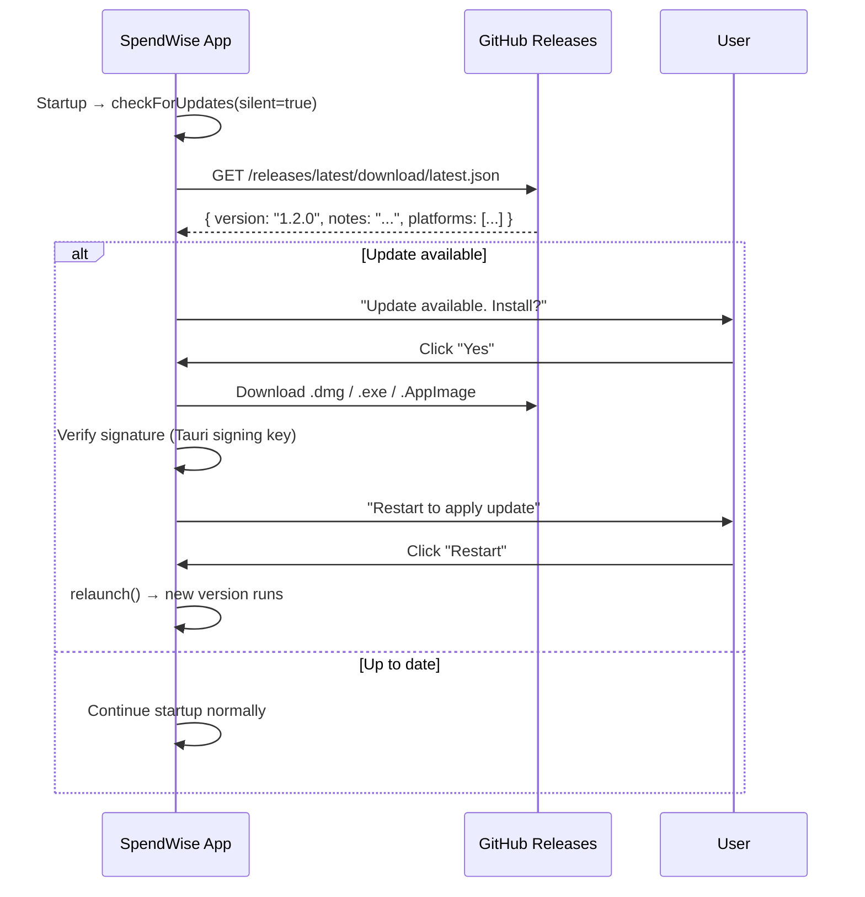
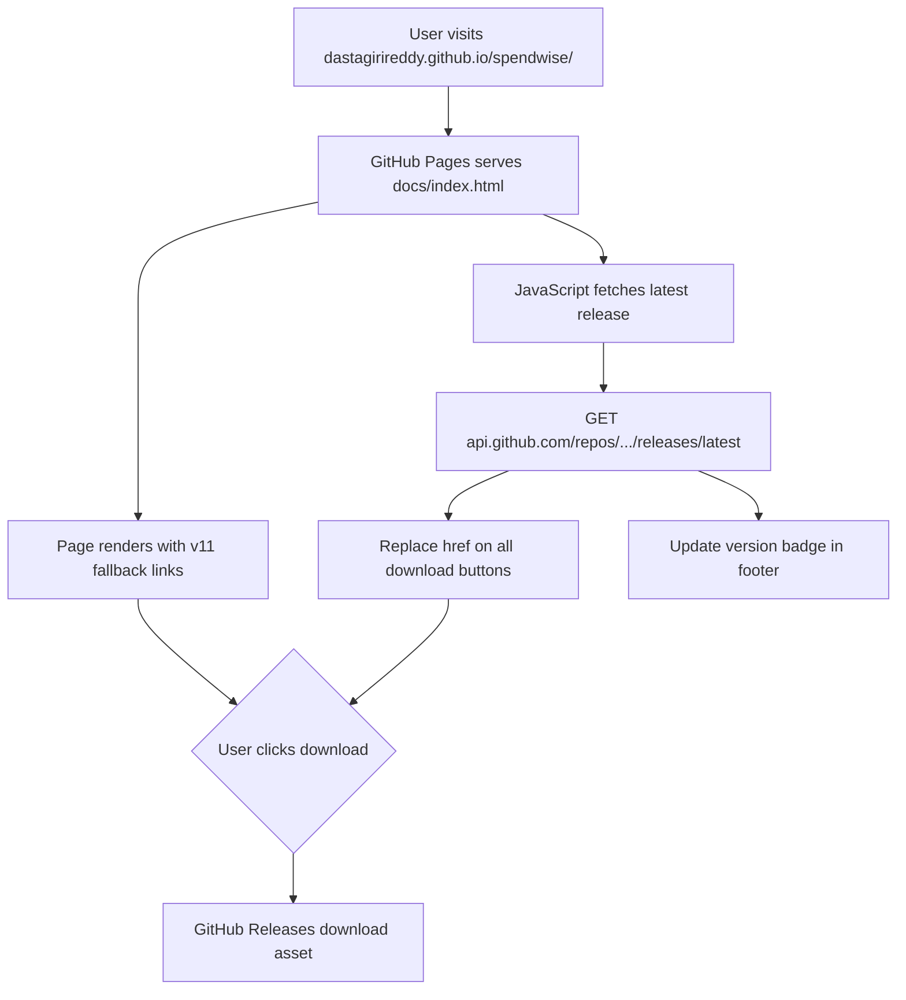

# SpendWise

Desktop expense tracker built with Tauri v2 + Vanilla TypeScript. Track fixed vs dynamic expenses, set budgets, and see where your money goes — all offline, all private.

## Features

- **Fixed vs Dynamic Budget** — Set recurring bills first, see what's left for flexible spending
- **Daily Spending Tracker** — Log purchases with categories and notes
- **Month-End Reports** — Visual summaries of spending vs planned
- **Multi-Profile Support** — Manage budgets for multiple people
- **100% Offline** — SQLite database stays on your machine
- **Auto-Updates** — Checks GitHub Releases for new versions on startup

## Tech Stack

| Layer | Technology |
|-------|-----------|
| Frontend | Vanilla TypeScript, Vite |
| Backend | Rust (Tauri v2) |
| Database | SQLite via `@tauri-apps/plugin-sql` |
| Icons | Lucide via `@iconify-json/lucide` |
| CI/CD | GitHub Actions |
| Distribution | GitHub Releases + GitHub Pages |

---

## Project Structure

```
spendwise/
├── src/                    # TypeScript frontend
│   ├── main.ts            # Entry point
│   ├── db.ts              # All SQLite queries
│   ├── updater.ts         # Auto-update logic
│   └── ...
├── src-tauri/              # Rust backend
│   ├── src/
│   │   ├── main.rs        # Tauri entry → calls lib.rs
│   │   └── lib.rs         # DB migrations, plugin setup
│   ├── tauri.conf.json    # App config, updater endpoints
│   ├── capabilities/
│   │   └── default.json   # Tauri permissions
│   └── icons/             # App icons (all sizes)
├── docs/                   # GitHub Pages site
│   └── index.html         # Download landing page
├── .github/workflows/
│   └── release.yml        # CI/CD pipeline
├── package.json
└── README.md
```

---

## CI/CD Pipeline

The entire release process is automated via GitHub Actions. Here's how it works end-to-end.

### High-Level Flow



### Full Pipeline Detail



### Build Matrix

Each platform runs independently with its own dependencies:

| Platform | Runner | Target | Output |
|----------|--------|--------|--------|
| macOS ARM | `macos-latest` | `aarch64-apple-darwin` | `.dmg` |
| macOS Intel | `macos-latest` | `x86_64-apple-darwin` | `.dmg` |
| Ubuntu | `ubuntu-22.04` | native | `.AppImage`, `.deb`, `.rpm` |
| Windows | `windows-latest` | native | `.exe`, `.msi` |

### Release Assets

Each release includes:

```
SpendWise_1.1.0_aarch64.dmg        # macOS ARM
SpendWise_1.1.0_x64.dmg            # macOS Intel
SpendWise_1.1.0_amd64.AppImage     # Linux (universal)
SpendWise_1.1.0_amd64.deb          # Linux (Debian/Ubuntu)
SpendWise-1.1.0-1.x86_64.rpm       # Linux (Fedora/RHEL)
SpendWise_1.1.0_x64-setup.exe      # Windows installer
SpendWise_1.1.0_x64_en-US.msi      # Windows (enterprise)
*.sig                               # Tauri update signatures
latest.json                         # Tauri updater manifest
```

---

## Auto-Update System



### Signing

Updates are signed with a Tauri keypair:

- **Private key** (`~/.tauri/spendwise.key`) — stored as GitHub Secret `TAURI_SIGNING_PRIVATE_KEY`
- **Public key** — embedded in `tauri.conf.json` → `plugins.updater.pubkey`
- **Signatures** (`.sig` files) — included in each release asset

The app verifies every downloaded update against the public key before installing.

---

## GitHub Pages Download Site



### How It Works

1. **Static fallback** — Download links hardcode v11 (works even if API fails)
2. **Dynamic update** — On page load, JavaScript calls GitHub API
3. **Link replacement** — Each download button gets the real URL from the latest release
4. **Version badge** — Footer shows "Latest: v{tag}"

No rebuild needed — publish a new release and the download page updates automatically.

---

## Database

SQLite with migrations defined in `src-tauri/src/lib.rs`:

| Version | Description |
|---------|-------------|
| 1 | Initial tables |
| 2 | Profiles |
| 3 | Categories |
| 4 | Budget limits |
| 5 | Expense notes |
| 6 | Recurring expenses |
| 7 | Settings |

Database file: `expense-tracker.db` (created at runtime in app data directory)

---

## Development

### Prerequisites

- [Node.js](https://nodejs.org/) (LTS)
- [pnpm](https://pnpm.io/)
- [Rust](https://rustup.rs/)
- Platform-specific dependencies ([Tauri guide](https://v2.tauri.app/start/prerequisites/))

### Commands

```bash
# Install dependencies
pnpm install

# Run in dev mode (Vite + Rust hot reload)
pnpm tauri dev

# Build for production
pnpm tauri build

# Frontend only (no Rust)
pnpm dev
```

### Key Files

| File | Purpose |
|------|---------|
| `src/main.ts` | Frontend entry point |
| `src/db.ts` | All SQLite queries |
| `src/updater.ts` | Auto-update logic |
| `src-tauri/src/lib.rs` | DB migrations, Tauri plugin setup |
| `src-tauri/tauri.conf.json` | App config, updater endpoint |
| `src-tauri/capabilities/default.json` | Tauri permissions |

---

## Release Process

### Automatic (recommended)

1. Push to `release` branch
2. GitHub Actions builds for all 4 platforms
3. Release job creates a draft release with all assets
4. Go to GitHub → Releases → Review and publish the draft

### Manual

```bash
# Create a release tag
git tag v1.2.0
git push origin v1.2.0

# Or trigger the workflow manually
gh workflow run release.yml
```

---

## Secrets

| Secret | Purpose |
|--------|---------|
| `TAURI_SIGNING_PRIVATE_KEY` | Signs auto-update artifacts |
| `GITHUB_TOKEN` | Auto-provided by GitHub Actions |

---

## License

MIT
